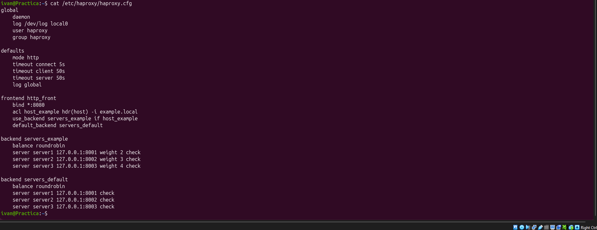
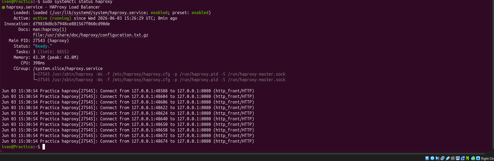

# Кластеризация и балансировка нагрузки

## Студент
Иван Чернобровкин

---

## Задание 1

Запустите два простых сервера Python на своей машине на разных портах.  
Установите и настройте HAProxy, используя материалы к уроку по ссылке.  
На настройке балансировки Round-robin на 4 уровне.  
При проверке настройте конфигурационный файл haproxy, скриншоты, где видно перенаправление запросов на разные серверы при обращении к HAProxy.

---

## Инструкция по выполнению домашних работ

В рамках работы была выполнена настройка балансировки нагрузки с использованием HAProxy и двух backend-серверов Python HTTP Server.

---

## Цель работы

Настроить распределение сетевого трафика между двумя серверами с использованием алгоритма Round Robin на уровне L4 (TCP) через HAProxy.

---

## Используемое ПО

- Ubuntu (виртуальные машины)
- HAProxy
- Python3 HTTP Server

---

## Схема сети

- HAProxy: 192.168.0.196  
- Server 1: 192.168.0.196:8000  
- Server 2: 192.168.0.230:8000  

## Скриншоты

### 1.1 Конфигурация HAProxy

### 1.2 Статус HAProxy

### 1.3 Балансировка

Задание 2

Запустите три простых сервера Python на своей машине на разных портах.
Настройте HAProxy для балансировки Weighted Round Robin на 7 уровне (HTTP), чтобы:

Server 1 имел вес 2
Server 2 имел вес 3
Server 3 имел вес 4

HAProxy должен балансировать только тот HTTP-трафик, который адресован домену example.local.
При проверке настройте конфигурационный файл HAProxy и сделайте скриншоты, где видно перенаправление запросов на разные серверы с использованием домена example.local и без него.

## Скриншоты

### 1.1 Конфигурация HAProxy

### 1.2 Статус HAProxy

### 1.3 Балансировка

